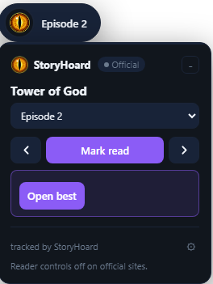

# StoryHoard

A lightweight, privacy-respecting Firefox and Chromium extension for tracking manga
across many sources and reading it on the source's own site. A floating on-site panel
handles tracking and reader enhancements, and a best-version picker surfaces the most
complete version of each title. All data lives locally in your browser; the only
network calls are to the manga sources you grant access to, (optionally) GitHub for
backup sync, and the official-sites list.

<p align="center">
  
</p>

## Features

**Library & tracking**

- Track titles with read / latest chapter numbers that survive mirror domain changes
- Star ratings, **tags with one-click source-genre suggestions**, user categories with filtering, reading-history timeline
- **List and grid views** with **per-page pagination** (10/15/20/50/100 items); filter by status (unread/reading/completed/manual)
- **Grouped reading history** (by title, expandable to chapters reached)
- **Command palette (Ctrl/Cmd-K)** to jump to any tab or library title
- Detail view per title; sort by recently read / added / title / latest chapter
- Bulk actions (multi-select to categorize, mark manual, add tags, or remove)
- Duplicate detection + merge
- Manual / "Do Not Scan" titles with hand-set chapter counts (for dead or hard-to-scrape sources)
- Automatic + per-source update checks, with failures surfaced in the UI
- **Reading-time estimate** (total + this week) and **activity heatmap** showing daily chapter completion
- **Reading statuses** - reading / paused / dropped / planning / completed, with optional auto-pause after a configurable number of inactive days
- **AniList sync** - connect with a token to import your list, push read progress (never lowers your AniList count), and sync statuses both ways

**Sources & discovery**

- Multi-source search across every supported site at once
- **Best-version picker** - search surfaces a single best version per title (most complete, in your language, official preferred), with official sites credited by name and other sources shown neutrally; other versions stay one click away
- **Source health indicator** (green/red/grey dots showing live/unreachable/unchecked)
- **Search skips recently-confirmed-dead sources** within 24h
- "Check mirrors" - find which supported sites carry a title, freshest first
- Re-link a title to a new source/mirror without losing progress
- Generic, config-driven adapters for the **Madara**, **MangaStream/ts**, **MangaBuddy**, and **FanFox** site families (adding a site is usually a config row, not new code), plus dedicated adapters for MangaDex, Kagane, WeebCentral, Webtoons, and a dozen more
- **Automatic cover fetching cached as data URLs** to bypass referer-blocking on source CDNs
- **Per-title genre suggestions** extracted from source pages (one-click bulk-add to tags)

**On-site reading**

- **Reading happens on the source's own site**, not a bundled reader. Opening a chapter opens it in a tab on the source itself.
- A **floating on-site panel** appears on supported chapter pages, with two variants keyed off an official-site allowlist:
    - On **official sites** (WEBTOON, MangaDex, MANGA Plus, Tapas, Comikey, INKR) the panel is **overlay-only** - track and navigate, no changes to the page.
    - On **other sites** it adds **reading-view controls** (fit-width, continuous scroll, light/dark).
- **Chapter dropdown, prev/next, and mark-read**, honouring your preferred language on multi-language sources.
- A quiet **"a more complete version is available"** hint when the best-version picker finds a better version of what you are reading - naming the destination only when it is an official site.

**Backup & sync**

- Human-readable JSON import/export
- Optional GitHub Gist sync (token stored locally; private gists)

**Community (opt-in)**

- Off by default. Opt in to sync anonymous reading events to the community API for achievements, star ratings, recommendations, trending titles, and a weekly leaderboard
- Anonymous auto-generated username; no account, email, or personal data

## Repository layout

- `apps/extension/` - the WXT + Svelte 5 extension (MV3)
- `apps/community-server/` - opt-in community stats API (Hono + SQLite, self-hosted)
- `apps/metadata-server/` - optional metadata catalog service (not currently deployed)
- `packages/` - shared contracts, the source SDK, and source adapters
- `tooling/` - browser tests and the source-probe triage tool
- `docs/` - architecture and development docs (see [docs/README.md](docs/README.md))
- `archive/` - previous implementations (not built)

## Installing (end users)

Download the latest release from the [Releases page](https://github.com/Ryuu3rs/storyhoard-extension/releases).

### Firefox

1. Download `storyhoard-X.X.X-firefox.xpi`
2. Open Firefox and go to `about:addons`
3. Click the gear icon → **Install Add-on From File…**
4. Select the `.xpi` file - Firefox will prompt you to confirm
5. Open the StoryHoard panel and grant source access when prompted

> Releases are submitted to Mozilla (AMO) for signing automatically. Install the signed `.xpi` attached to the GitHub release, or install from the AMO listing.

### Firefox for Android

Firefox for Android supports the same `.xpi`. Install the signed release from the AMO listing in Firefox for Android. For local testing, use remote debugging via `about:debugging` on a connected desktop - see [docs/ANDROID.md](docs/ANDROID.md).

### Chrome / Chromium / Edge / Brave

Chrome no longer allows installing packed extensions from outside the Web Store (Google removed that in 2018). Until the extension is published on the Chrome Web Store, manual install requires developer mode:

1. Download `storyhoard-X.X.X-chrome.zip` and **unzip it** to a permanent folder (don't delete it - Chrome loads it live from that folder)
2. Open `chrome://extensions` (or `edge://extensions` / `brave://extensions`)
3. Enable **Developer mode** (toggle, top-right)
4. Click **Load unpacked** and select the unzipped folder
5. Open the StoryHoard panel and grant source access when prompted

> The extension stays loaded as long as the folder exists. If you move or delete the folder it will stop working - just re-load it from the new location.

---

## Requirements (developers)

- Node.js 22 or newer
- npm 11 or newer

## Install (developers)

```powershell
npm install
```

## Development

```powershell
npm run dev          # Chromium
npm run dev:firefox  # Firefox
```

WXT launches a development browser with the extension loaded and hot-reload.

## Build

```powershell
npm run build
npm run build:firefox
```

Build output is generated under `apps/extension/.output/`.

## Validate

```powershell
npm run check        # format check, lint, typecheck, build (both browsers), tests
```

## Loading a build manually

- **Firefox:** `about:debugging#/runtime/this-firefox` → Load Temporary Add-on →
  pick any file in `apps/extension/.output/firefox-mv3/`.
- **Chromium:** `chrome://extensions` → enable Developer mode → Load unpacked →
  `apps/extension/.output/chrome-mv3/`.

After loading, open the extension and grant source access so it can fetch from the
manga sites you use.

### Android (Firefox)

Firefox for Android supports extensions, and the same `firefox-mv3` build runs there
unchanged. The cleanest path is installing the **AMO-signed `.xpi`** once published:
open the AMO listing (or a Firefox Add-on Collection containing it) in Firefox for
Android and tap **Add to Firefox**. After install, open the dashboard and grant source
access so it can fetch from the manga sites you read.

For an unsigned local build you must use remote debugging: enable USB debugging on the
phone, connect it to a desktop, and use `about:debugging` → **This Firefox** → **Load
Temporary Add-on** targeting the connected device. Temporary add-ons are cleared when
Firefox restarts, so the signed XPI is the only persistent option. See
[docs/ANDROID.md](docs/ANDROID.md) for install options, limitations, and a test checklist.

## Supported sources

Built-in adapters cover:

- **MangaDex** - full API, multi-language
- **Kagane** - JSON API with an integrity/manifest handshake
- **WeebCentral, Dynasty Scans, Asura Scans, Webtoons, MangaHub, MangaKatana, Flame Comics, MangaFreak, Comix, OlympusStaff, MangaRead, Mgeko, mangak.io** - dedicated adapters
- **Madara family** - config-driven WordPress Madara sites (GD Scans, Tritinia Scans, ManhuaUS, MgRead, NatoManga, and more)
- **MangaStream / ts family** - Thunder Scans, Kappa Beast, Spider Scans
- **FanFox / MangaHere** - chapter tracking and navigation (pages open on the site)

Add a new site in the appropriate family by adding a single config row in `packages/sources/src/`. See [docs/architecture/SOURCE_ADAPTERS.md](docs/architecture/SOURCE_ADAPTERS.md).

## Contributing

1. Fork → branch from `main` → open a PR
2. Run `npm run check` (format check + lint + typecheck + both builds + tests) before submitting
3. Adapters: one file per site family, config-driven where possible
4. Commits follow [Conventional Commits](https://www.conventionalcommits.org/) (`feat:`, `fix:`, `chore:`, etc.) - releases are automated from commit messages

## Source triage

`tooling/source-probe/` probes candidate mirror sites for reachability, anti-scrape
posture (Cloudflare / Turnstile / DDoS-Guard / captcha), and CMS template, scoring
each for adapter viability:

```powershell
npm run probe -w @amr/source-probe
```

## Releases

Releases are automated with release-please (see [CONTRIBUTING.md](CONTRIBUTING.md)). Each GitHub release carries the Chrome and Firefox zips plus SHA256SUMS.txt; the AMO-signed Firefox .xpi is attached automatically once Mozilla approves the submission. The extension periodically checks GitHub for newer versions and offers an in-app "Download update" button that saves the matching zip to your Downloads folder - it never installs or executes update code automatically.

## Documentation

See [docs/README.md](docs/README.md) for architecture, source adapter authoring, and development guides.

## License

Licensed under the **Apache License, Version 2.0** (see [LICENSE](LICENSE) and [NOTICE](NOTICE)).

StoryHoard is an original codebase. It shares the "All Mangas Reader" name with an earlier,
unmaintained extension of that name but contains none of its code. You may use, modify and
redistribute it under the Apache-2.0 terms; the StoryHoard name and logo are not part of that
grant.
